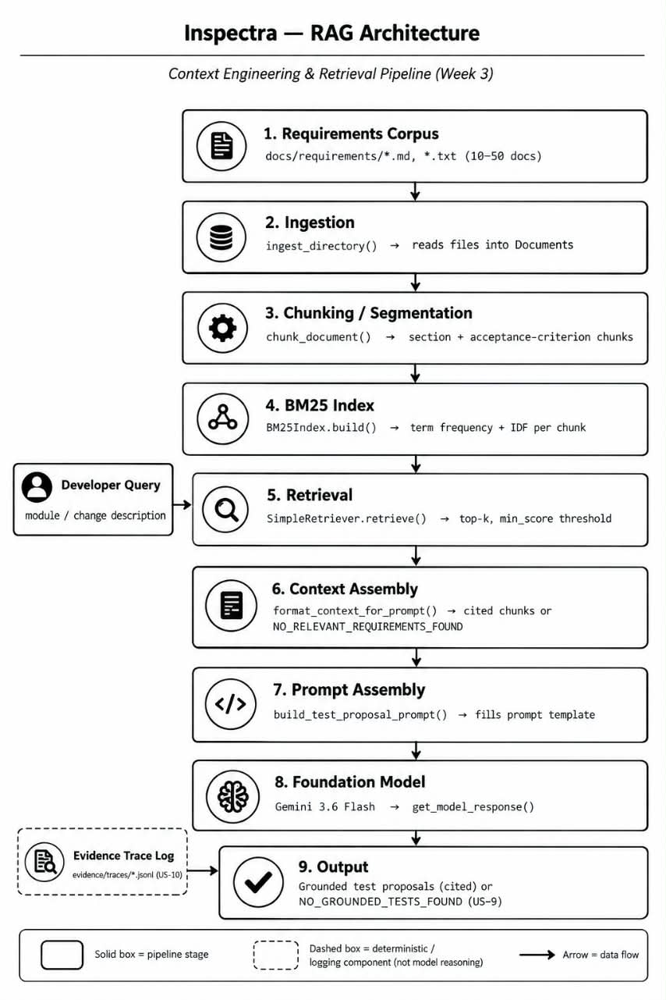

# WEEKLY PROGRESS REPORT (WEEK 3)
**BSE4104 AI-Native & Agentic Engineering Capstone**  
**GROUP S**  
**PROJECT:** Software-Engineering QA Agent  

---

### 1. Work Completed Against Weekly Objectives
The primary objective for Week 3 was to ground model generation in a controlled, traceable knowledge source using a Retrieval-Augmented Generation (RAG) pipeline. All five weekly activities were achieved:
* **Controlled Corpus Assembly:** Created a version-controlled requirements corpus under `docs/requirements/` (`cancellation.md`, `downgrade.md`, `notifications.md`, `refund.md`, `trial_period.md`, and `subscription.md`) with explicit section labelling and provenance.
* **Ingestion, Indexing & Retrieval Implementation:** Built an automated ingestion and chunking pipeline in `src/rag.py` using BM25 lexical ranking and strict score thresholds.
**Figure 1: RAG Architecture — Context Engineering Pipeline**

* **15-Case RAG Evaluation Suite:** Designed and executed a comprehensive 15-question evaluation suite in `docs/evaluation/rag_evaluation_questions.json` spanning Answerable, Partially Answerable, and Deliberately Unanswerable categories.
* **Failure Analysis:** Investigated, empirically reproduced, and documented three retrieval and grounding failure modes in `docs/evaluation/retrieval_grounding_failures.md`.

---

### 2. Key Engineering Decisions and Rationale
* **BM25 Lexical Search for Initial Indexing:** Selected BM25 lexical scoring over generic dense vector embeddings for this phase to ensure deterministic keyword matching for specific software identifiers, exact exception class names (`TrialAlreadyUsedError`), and explicit monetary values.
* **Separation of Retrieval Traces from Generation Traces:** Structured `src/run_rag_evaluation.py` to record BM25 chunk IDs and relevance scores independently of model responses to distinguish pure retrieval misses from LLM grounding failures.
* **Explicit Refusal Fallback (`min_score=1.0`):** Enforced a strict minimum relevance score threshold. Queries scoring below 1.0 automatically yield `NO_RELEVANT_REQUIREMENTS_FOUND`, preventing hallucinations on ungrounded queries.
* **Batch Request Pacing:** Enforced rate-limit delays (`time.sleep(65.0)` / dynamic backoff) in `src/model_client.py` to reliably navigate free-tier Requests-Per-Minute (RPM) API quotas without failing batch evaluation runs.

---

### 3. Challenges and Current Response
**Rate Limiting (Quota Exceeded):**  
* **Challenge:** Rapid sequential execution of evaluation cases triggered free-tier rate limits (20 RPM cap).  
* **Response:** Updated `src/model_client.py` with backoff logic catching `genai_errors.APIError` and inserted configurable delays in the batch runner.  

---

### 4. Repository & Project Management Evidence
* **GitHub Repository:** https://github.com/carltontrevor23/software-engineering-qa-agent
* **ClickUp Board Link:** https://app.clickup.com/1200440000000401/v/b/li/1200440000008198

---

### 5. Individual Contribution Summary
* **[Praise Assimire] Corpus Curation & Provenance:** Authored and formatted the controlled specification documents with section IDs, acceptance criteria, and explicit open-scope notes. *Evidence: (`docs/requirements/cancellation.md`, `downgrade.md`, `notification.md`, `refund.md`, `trial_period.md`)*
* **[Carlton Ayebare] Pipeline & Indexing Implementation:** Developed core segmenting, indexing, and BM25 search mechanics. *Evidence: `src/rag.py` and unit tests in `tests/test_rag.py`.*
* **[Ednah Kirabo] Prompt Engineering & Evaluation Design:** Constructed model context from retrieved evidence and showed sources in the response. *Evidence: changes in `src/model.py`.*
* **[Modest Nakiroya] Prompt Engineering & Evaluation Design:** Authored `prompts/rag_answer_prompt_v1.0.txt` and constructed the 15-case question matrix. *Evidence: `prompts/rag_answer_prompt_v1.0.txt`, `docs/evaluation/rag_evaluation_questions.json`.*
* **[Marvin Bisaso] Documented Retrieval Failures & Root Cause Analysis:** Authored the 3-scenario failure root-cause analysis and handled model client rate-limit resilience. *Evidence: `docs/evaluation/retrieval_grounding_failures.md`, `src/model_client.py`.*

---

### 6. Plan for Next Week (Week 4: Tools & Function Calling)
* **Define Tool Catalogue & Schemas:** Define at least two deterministic tools with JSON input/output schemas, authorization scopes, and error-handling behaviours (e.g., a file/repo reader tool and a sandboxed test runner execution tool).
* **Application Orchestration:** Implement function/tool-calling capabilities through the model client/orchestrator layer.
* **Simulate State / Side Effects:** Implement at least one tool that retrieves live application data or performs low-risk simulated state mutation (e.g., ticket/issue draft creation or ledger read).
* **Robustness & Boundary Testing:** Build negative tests validating behaviour on missing parameters, unauthorized tool calls, unavailable external services, and malformed outputs.
* **Human-in-the-Loop Gate:** Add an explicit human-approval mechanism blocking high-impact actions before execution (aligned with the project charter boundary matrix).